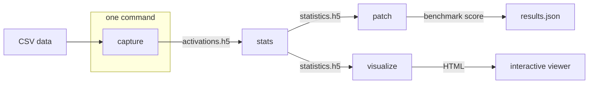

# Concepts

## The pipeline

`cap run` chains **capture → visualize** for you (capture already writes `statistics.h5`).
`cap stats` and `cap patch` are separate steps you invoke when you need to recompute
statistics with a different test, or validate the discovered neurons on a benchmark.

## Contrastive groups

Everything in CAP is built on **two groups of text** whose activations you want to
compare. There are two ways to define them:

- **Label split** (`--data … --label-column`): one CSV, split by a binary label. Rows
  labelled `1` are group A; the rest are group B. Good for *faithful vs. unfaithful*.
- **Two files** (`--group-a … --group-b …`): two CSVs sharing a text column. Good for
  *English vs. Mandarin* on parallel content.

Each text is wrapped in a **[prompt template](cli_reference.md#prompt-types)** before it
reaches the model, so the model is asked a consistent question across both groups.

## Capturing activations

For each prompt, CAP registers forward hooks on every layer and records the activation at
the **last token** (the position the model answers from). It stores one activation matrix
per layer per group in `activations.h5`.

## Welch t-test and FDR correction

For every neuron (every dimension of every layer) CAP runs a **Welch's t-test** — the
unequal-variance form of the two-sample t-test — comparing group A against group B. This
yields a t-statistic and a p-value per neuron.

Testing thousands of neurons at once inflates false positives, so CAP applies a
**Benjamini–Hochberg FDR correction** (`fdr_bh`) to the p-values. It also records the
effect size (**Cohen's d**) and the mean difference. A neuron is flagged *significant*
when its corrected p-value clears the threshold. All of this lands in `statistics.h5`.

Other tests are available (`ttest`, `mannwhitney`) via `cap stats`; Welch is the default.

## Neuron patching

Finding neurons that *correlate* with the contrast is not proof they *cause* the
behaviour. `cap patch` tests causality: it selects neurons by effect size
(`--d-threshold` on Cohen's d, `--std-threshold` on pooled standard deviation), then
**scales** their activations by `--scale` (0.0 ablates them entirely) while the model runs
a benchmark. If ablating the discovered neurons moves the benchmark score, they were doing
real work.

Built-in benchmarks are `gsm8k`, `mmlu`, and `hellaswag` (require the `lm-eval` extra), or
supply your own via `--evaluator module::ClassName` — see
[Bring Your Own Data](tutorials/bring_your_own_data.md) and the
[Data API](api/data.md).

## Steering

`--scale` is a **multiplicative knob**, not just an on/off switch, so the same `cap patch`
step doubles as a **training-free steering intervention**:

- `--scale 0.0` — ablate the selected neurons (the causality test above).
- `--scale 1.0` — leave them untouched (the model's baseline).
- `0 < --scale < 1` dampens the behaviour; `--scale > 1` amplifies it.

Pick a gentle factor (say `--scale 1.05`) and read the benchmark delta to *steer* the
target behaviour up or down with no fine-tuning — the discovered neurons become a control
surface. The effect is not guaranteed to transfer: a factor that helps one language, task,
or model can hurt another, so **sweep `--scale`** and compare the benchmark movement rather
than assuming a fixed value generalises.

## Visualization

`cap visualize --mode stats` renders an interactive per-layer heatmap of the statistics.
`cap visualize --mode similarity` takes **multiple** experiment directories and draws the
per-layer cosine similarity between their statistics — this is how you compare the neuron
signatures of the *same* contrast across different languages.
